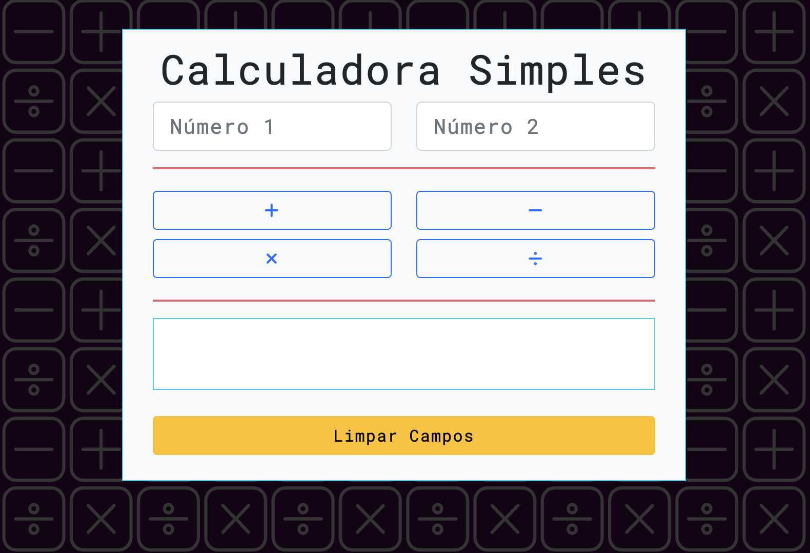

<h1 align="center">Calculadora Simples</h1>
<h6 align="center">Projeto desenvolvido para a FIAP  Curso: Engenharia de Software  (1ESO - 2/2022)</h6>

 

<h3>Descritivo da atividade:</h3>

>_Crie um script que colete dois números digitados pelo usuário utilizando campos input na página e os botões “somar”, “subtrair”, “dividir” e “multiplicar”._

>_Ao clicar nos botões, eles devem executar uma função que verifica qual botão está sendo clicado e faça a operação correspondente e exiba o resultado em um parágrafo!_

